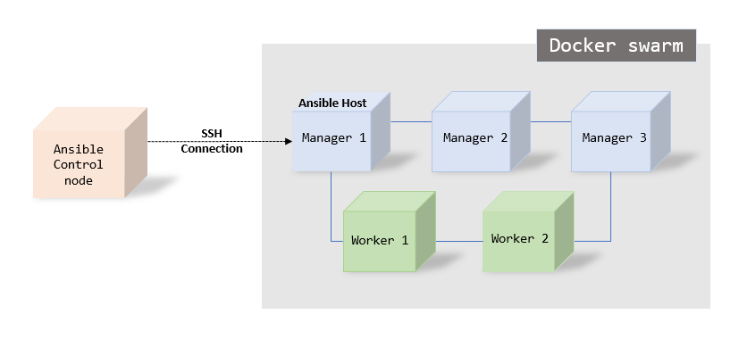
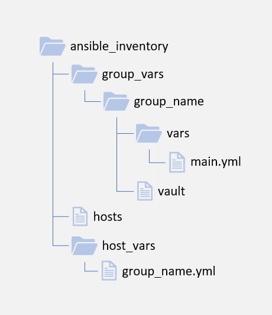
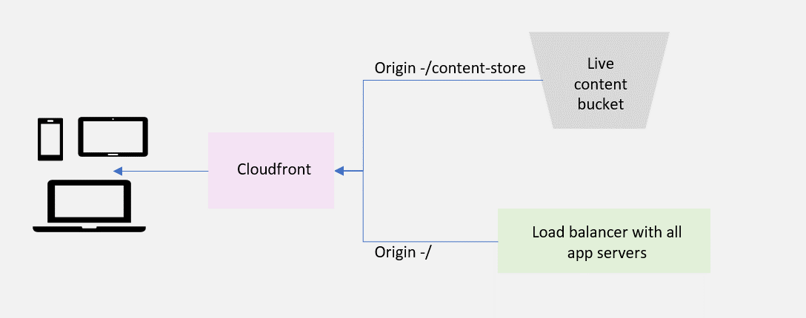

# Eagle Deployment

### Architecture

Eagle is built on [Sunbird](https://www.sunbird.org/ "Sunbird"). To know more about Sunbird visit their website https://www.sunbird.org/

The deployment architecture of Eagle is from Sunbird. Refer the __Sunbird Github Repository__ - https://github.com/project-sunbird/sunbird-devops

## Deployment
The deployment of Sunbird is done in 3 modules. They are as follows
  1. Core
  2. Knowledge Platform
  3. Data Pipeline

Eagle deployment uses the Knowledge Platform and Data Pipeline as-is, where as the core uses a different set of application deployments all together called as Eagle Core. This is required along with the nginx and Keycloak deployment of Sunbird core.

### Prerequisites
  1. Operating System - Linux based: Preferably [Ubuntu](https://ubuntu.com/)
  2. Container orchestration platform - [Docker swarm](https://docs.docker.com/engine/swarm/)
  3. Application deployment/Configuration management tool - [Ansible](https://www.ansible.com/)

Eagle core uses Sunbird's architecture for the underlying infrastructure. All applications are deployed as services on Docker swarm and deployments are done using Ansible. Configuration management for these app services also use ansible.

### Docker swarm Architecture
Sunbird recommends a minimum of 3 masters and 2 worker nodes for a minimal HA setup for it's app services. This does not include the Databases, Logging and DevOps VMs.
Since Eagle's underlying architecture is based on sunbird, the same recommendation is inherited.

However, the number of Virtual machine and the capacity of them will depend on the usage requirements of each deployment.

__Example:__
A minimal Docker swarm with 5 VMs on AWS would be named and deployed as follows
  1. Manager 1 - AZ 1A
  2. Manager 2 - AZ 1A
  3. Manager 3 - AZ 1B
  4. Worker 1 - AZ 1A
  5. Worker 2 - AZ 1B

### Connectivity
Ansible's connectivity should be enabled between the Ansible Control node and Ansible Managed node (host).

Docker swarm deployments happen only on through the manager nodes and hence we configure our manger nodes as Ansible host.

Right now, Eagle setup is configured  a single manager node as a Ansible host and the user used for deployment needs to have access to docker group on the manager node.

_Image: Ansible connectivity for application deployment._

### Ansible project structure
All application deployment of Eagle are performed by ansible playbooks. Each application service is created as a role.

Every role has a responsibility to deploy a single docker service onto the docker swarm and all the components needed for it. This way we keep each role separate and maintain a one-to-one relationship between the service and the role.

__Aim__:
  The aim of each role is to create a docker compose file(.yml) and an environment file(.env) using templates of ansible playbook which the docker service will be using to perform a deployment on the master node.

__Variables__:
  Variables for these roles are separated and stored at 3 different levels
  1. Inventory - This is where we store variables which are different for different environments. (Example: Dev, Stage, Prod) or different instances of Eagle and which are shared between multiple roles/services
  2. Role Level - This is where we store variables which are specific to the role/docker service. (Example: Location of env files, any configs specific to a particular service)
  3. Playbook Level - This is where we store variables which would not change with environment, but will be used between multiple roles/services. (Example: service names of other services, ports of other services)

  Other than this, there is one special case where variables are stored, which is the common vars place. This is used for the use-case where a single file is used as a whole for multiple services. (Example: UI-Shared in Eagle instance)

__Inventory Structure__:
  A sample structure is uploaded here (Add link here). Pictorial representation of the structure is below  

  

  _Image: Ansible inventory directory structure_

__Roles__:
  Roles follow ansile playbook roles structure.

### S3 Structure and configuration
__Introduction__:
Eagle uses Amazon S3 for storing it's content. Content on S3 refers to the physical files the authors create while creating the content on Eagle. The process of reading the file as input and storing it on S3 happens using the content service.

The storage on S3 is broadly divided into 3 categories of buckets.
  <ol>
    <li>Content bucket</li>
    <ol>
      <li>Pre-publish (authoring) bucket</li>
      <li>Main (Live) bucket</li>
    </ol>
    <li>Images bucket</li>
    <ol>
      <li>Pre-publish (authoring) bucket</li>
      <li>Main (Live) bucket</li>
    </ol>
    <li>Downloads bucket</li>
  </ol>
Images and Content bucket will have one bucket used for authoring and one for the Live content.
Downloads bucket is one and content gets updated when there is a publish.

Therefore at anytime, we have only one version of content which is Live.

__Authorization and Access Control__:
All the buckets created for Eagle are private and none of them will have public access. Direct availability of the data on these buckets will be only via Cloudfront. More on this will be available in the Cloudfront section.

The CRUD activities on S3 happen through content service. Content service uses Node.js SDK to perform these operation. AWS SDK communication happens using the AWS Access Key and Secret Key. Refer this link to generate one [Get your AWS access key](https://aws.amazon.com/premiumsupport/knowledge-center/create-access-key/) and make sure this is kept safe in vault.

### Cloudfront configuration
__Introduction__:
Cloudfront is configured to serve the UI of the application and the content of the application. For serving the UI, we create an origin with / as the root and make it point to the app servers or its load balancer.

For serving the content, we need to create an origin with route <i>/content-store</i> and point it to Live content bucket.

__Access Restriction__:
Access for content-store prefix is access restricted using the Signed Cookies of Cloudfront. The signed cookies are generated and sent to the consumer by the content service when an authorized user is using the application.

Same thing is also required from images as well. Where <i>/content-store</i> points to the Live images bucket.

Hence S3 access is provided to only Cloudfront and Cloudfront access is agin provided to a Logged in user by the application.

_Image: Application and content access via cloudfront_

__Note__: In the process of adding the app as the origin, the apis will also now be served through cloudfront. This is not something we want for now and we need to add a behaviour as /api* and make sure you do not cache any api.
